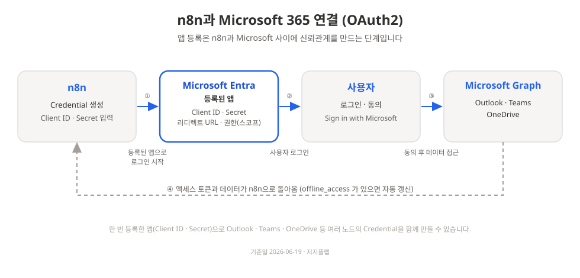

# Microsoft 365 연결하기 (Outlook · Teams · OneDrive)

n8n에서 Microsoft 365 노드(Outlook, Teams, OneDrive 등)를 쓰려면 한 번만 거치면 되는 연결 작업이 있습니다. 이 문서는 처음 하는 분도 화면을 보며 그대로 따라 할 수 있도록 클릭 단위로 정리했습니다.

> **기준일: 2026-06-19** · n8n 2.17.x 기준
> Microsoft는 화면 메뉴 이름과 위치를 자주 바꿉니다. 버튼 이름이 문서와 다르면 당황하지 말고, 아래 "원칙"만 같으면 됩니다. 각 단계의 **공식 문서 링크**를 1순위로 확인하세요.
> - n8n 공식: [Microsoft credentials](https://docs.n8n.io/integrations/builtin/credentials/microsoft/)
> - Microsoft 공식: [앱 등록 방법(Entra ID)](https://learn.microsoft.com/ko-kr/entra/identity-platform/quickstart-register-app)

---

## 0. 이 문서가 다루는 것

| 다루는 것 | 다루지 않는 것 |
|---|---|
| 개인/회사 Microsoft 계정으로 n8n에 Outlook·Teams·OneDrive 연결 | n8n 자체 설치 |
| 한 개의 Microsoft 앱으로 여러 노드를 함께 쓰는 법 | Microsoft 365 요금제 구매 |
| 연결이 막힐 때 점검 순서 | 사내 보안정책 변경 요청 (담당 부서 협의 필요) |

연결은 크게 두 부분입니다.

1. **Microsoft 쪽**에서 "앱"을 하나 등록하고 열쇠 두 개(Client ID, Client Secret)를 발급받습니다.
2. **n8n 쪽**에서 그 열쇠를 입력하고 "Microsoft로 로그인"을 눌러 연결을 마칩니다.



---

## 1. 시작 전 준비물

아래 3가지를 먼저 확인하세요. 하나라도 막히면 §7 트러블슈팅을 봅니다.

| 확인 | 내용 | 막히면 |
|---|---|---|
| n8n 주소 | 내 n8n에 접속하는 웹 주소 (예: `https://내n8n주소`) | 로컬에서만 쓰면 외부 접속 주소(터널 등)가 필요할 수 있음 |
| Microsoft 계정 | 개인 계정 또는 회사 계정 | 회사 계정은 앱 등록이 막혀 있을 수 있음(아래 권한 항목) |
| 앱 등록 권한 | Microsoft Entra에서 앱을 새로 등록할 수 있는 권한 | 회사 계정이면 관리자 동의가 필요할 수 있음(§3-4, §7) |

> **회사(사내) 계정 주의**: 많은 회사가 보안상 일반 직원의 앱 등록을 막아둡니다. 등록 화면이 안 열리거나 "관리자 승인 필요"가 뜨면, 개인 Microsoft 계정으로 진행하거나 IT 담당자에게 요청하세요. 이 판단을 먼저 해두면 뒤에서 시간을 아낍니다.

---

## 2. 큰 그림: 한 개의 앱으로 여러 노드를 쓴다

n8n의 Microsoft 노드(Outlook, Teams, OneDrive, Excel, SharePoint 등)는 **모두 같은 방식(OAuth2)**으로 연결합니다. 그래서 Microsoft에 앱을 **한 번만** 등록해두면, 그 앱 하나로 여러 노드의 연결을 만들 수 있습니다. 노드마다 다른 것은 "필요한 권한(스코프)"뿐입니다(§5 표).

정리하면 이 순서로 진행합니다.

```
[1부] Microsoft Entra에서 앱 등록  →  Client ID + Client Secret 확보
[2부] n8n에서 Credential 생성       →  열쇠 입력 + Microsoft 로그인
[검증] 테스트 1건 실제 실행         →  "연결됨"을 눈으로 확인
```

---

## 3. 1부: Microsoft Entra에서 앱 등록

> **원칙(잘 안 바뀜)**: 앱 등록 → 리디렉트 주소 등록 → 비밀 키 생성 → 권한 추가 → (회사 계정이면) 관리자 동의.
> **세부 클릭(자주 바뀜)**: 아래 메뉴 이름. 다르면 공식 링크를 보세요.

### 3-1. 앱 만들기

1. [Microsoft Entra 관리 센터](https://entra.microsoft.com)에 로그인합니다.
2. 계정이 여러 개(여러 조직)면, 오른쪽 위 **설정(톱니바퀴)** 에서 앱을 등록할 조직(테넌트)으로 전환합니다.
3. 왼쪽 메뉴에서 **Entra ID > 앱 등록(App registrations)** 으로 이동한 뒤 **새 등록(New registration)** 을 클릭합니다.
4. **이름(Name)** 에 알아볼 수 있는 이름을 입력합니다. 예: `n8n-automation`. (나중에 바꿔도 됩니다.)
5. **지원되는 계정 유형(Supported account types)** 을 고릅니다.
   - **회사 계정만 쓰고, 내 조직 안에서만 쓸 것** → "이 조직 디렉터리의 계정만(Single tenant)"
   - **개인 계정도 함께** 쓰거나 폭넓게 쓰려면 → "모든 조직 디렉터리의 계정 + 개인 Microsoft 계정"
   - n8n 공식 문서는 폭넓은 호환을 위해 후자를 안내합니다. 회사 보안정책이 단일 테넌트를 요구하면 전자도 정상 동작합니다.
6. **리디렉션 URI** 는 다음 단계에서 넣을 예정이니 지금은 비워도 됩니다. **등록(Register)** 을 클릭합니다.
7. 등록이 끝나면 **개요(Overview)** 화면이 뜹니다. 여기서 **애플리케이션(클라이언트) ID** 와 **디렉터리(테넌트) ID** 를 메모해둡니다. (Client ID는 잠시 후 n8n에 입력합니다.)

### 3-2. 리디렉트(콜백) 주소 등록 (가장 흔한 실패 지점)

OAuth 로그인을 마치면 Microsoft가 사용자를 다시 n8n으로 돌려보내야 합니다. 그 "돌아올 주소"를 Microsoft 앱에 등록해야 합니다.

1. 먼저 **n8n을 새 탭에서 엽니다.** n8n에서 Microsoft Credential을 만들기 시작하면(§4-1) 화면에 **OAuth Callback URL(또는 OAuth Redirect URL)** 이 보입니다. 이 값을 **복사**합니다.
   - 보통 형태는 `https://내n8n주소/rest/oauth2-credential/callback` 입니다.
   - **반드시 화면의 값을 그대로 복사하세요.** 직접 손으로 입력하면 한 글자만 달라도 로그인이 실패합니다.
2. Entra 앱의 **관리(Manage) > 인증(Authentication)** 으로 이동합니다.
3. **플랫폼 추가(Add a platform) > 웹(Web)** 을 선택합니다.
4. **리디렉션 URI** 칸에 1번에서 복사한 n8n 콜백 URL을 붙여넣고 저장합니다.

> 앱을 처음 등록할 때(3-1의 6번) 리디렉션 URI 칸에 바로 붙여넣어도 됩니다. 그 경우 이 단계는 건너뜁니다.

### 3-3. 클라이언트 비밀(Client Secret) 만들기

1. 앱의 **관리(Manage) > 인증서 및 비밀(Certificates & secrets)** 으로 이동합니다.
2. **새 클라이언트 비밀(New client secret)** 을 클릭하고, 설명과 만료 기간을 정한 뒤 추가합니다.
3. 생성된 비밀의 **값(Value)** 을 즉시 복사합니다.
   - ⚠️ 이 **값(Value)** 은 **그 화면을 벗어나면 다시 볼 수 없습니다.** 바로 복사해 안전한 곳에 보관하세요. (옆에 보이는 "비밀 ID"가 아니라 **값(Value)** 입니다.)
   - 만료 기간이 지나면 연결이 끊깁니다. 만료일을 기록해두고 미리 갱신하세요.

이제 열쇠 두 개가 준비됐습니다: **Client ID**(3-1), **Client Secret 값**(3-3).

### 3-4. 권한(API 권한) 추가 + 관리자 동의

앱이 메일을 읽거나 파일을 다루려면 그에 맞는 권한이 필요합니다.

1. 앱의 **관리(Manage) > API 권한(API permissions)** 으로 이동합니다.
2. **권한 추가(Add a permission) > Microsoft Graph > 위임된 권한(Delegated permissions)** 을 선택합니다.
3. §5 표에서 쓰려는 노드에 맞는 권한 이름을 검색해 체크하고 추가합니다.
4. (회사 계정인 경우) **`<조직 이름>`에 대한 관리자 동의 허용(Grant admin consent)** 을 클릭합니다. 권한 상태가 "부여됨(Granted)"으로 바뀌면 됩니다.
   - 이 버튼이 회색이면 관리자 권한이 없는 것입니다. IT 담당자에게 동의를 요청하세요.

> Teams는 다른 노드보다 관리자 동의가 필요한 경우가 많습니다(§5, §7).

---

## 4. 2부: n8n에서 Credential 만들고 로그인

### 4-1. Credential 생성

1. n8n에서 **Credentials > Create Credential(또는 노드 안의 Credential 드롭다운 > Create New)** 을 엽니다.
2. 쓰려는 노드에 맞는 자격증명 종류를 고릅니다.
   - Outlook → **Microsoft Outlook OAuth2 API**
   - Teams → **Microsoft Teams OAuth2 API**
   - OneDrive → **Microsoft OneDrive OAuth2 API**
   - (여러 Microsoft 서비스를 직접 묶어 쓰는 고급 사용이면 일반 **Microsoft OAuth2 API** 를 쓰고 스코프를 직접 입력합니다. 위 노드별 종류는 필요한 스코프가 미리 들어 있어 더 쉽습니다.)
3. 화면에 보이는 **OAuth Callback URL** 을 복사해 두지 않았다면 지금 복사해 §3-2에 등록합니다.
4. **Client ID** 에 §3-1의 애플리케이션(클라이언트) ID를, **Client Secret** 에 §3-3의 비밀 값을 붙여넣습니다.

### 4-2. Microsoft 로그인으로 연결 완료

1. 같은 화면의 **Sign in with Microsoft(Microsoft 계정으로 로그인)** 버튼을 누릅니다.
2. 팝업에서 Microsoft 계정으로 로그인하고, 요청하는 권한에 **동의(Accept)** 합니다.
3. 팝업이 닫히고 n8n에 **연결됨(Account connected)** 표시가 뜨면 성공입니다.
4. 같은 Microsoft 앱(같은 Client ID/Secret)으로 다른 노드용 Credential도 똑같이 만들 수 있습니다. 노드 종류만 바꾸면 됩니다.

---

## 5. 노드별 필요 권한(스코프)

아래는 자주 쓰는 기본 권한입니다. **실제로 필요한 권한은 워크플로에서 어떤 동작을 하느냐에 따라 달라집니다.** 노드별 자격증명을 쓰면 n8n이 기본 스코프를 자동으로 요청하므로, Entra에서는 이 표에 맞춰 **같은 권한을 부여**해주면 됩니다.

| 노드 | Microsoft Graph 위임 권한(예) | 비고 |
|---|---|---|
| Outlook | `User.Read`, `Mail.ReadWrite`, `Mail.Send`, `offline_access` | 공유 사서함을 쓰려면 n8n 자격증명에서 "Use Shared Inbox" 켜고 대상 사용자 UPN 입력 |
| OneDrive | `User.Read`, `Files.ReadWrite.All`, `offline_access` | Excel 노드도 OneDrive 파일 권한을 함께 씀. **단 Excel 노드는 개인 계정 미지원 → §7-1** |
| Teams | `User.Read`, `Group.ReadWrite.All`, `Channel.ReadBasic.All`, `ChannelMessage.Send`, `offline_access` | 관리자 동의가 필요한 경우가 많음 |

> `offline_access`는 "토큰 자동 갱신"에 필요합니다. 빠지면 일정 시간 뒤 연결이 끊겨 다시 로그인해야 합니다.

> ⚠️ **자주 바뀌는 지점 (기준일 2026-06-19)**: 위 스코프 이름과 n8n 노드가 요구하는 정확한 목록은 버전에 따라 달라질 수 있습니다. 연결이 "권한 부족"으로 실패하면, n8n 노드 실행 시 나오는 오류 메시지의 권한 이름을 Entra의 API 권한에 그대로 추가하세요. 권한 이름의 정본은 [Microsoft Graph 권한 참조](https://learn.microsoft.com/ko-kr/graph/permissions-reference)입니다.

---

## 6. 검증 체크리스트: "연결됨"을 실제로 확인

설정만 끝낸 상태와 실제로 동작하는 상태는 다릅니다. 아래를 직접 한 번씩 실행해 보세요.

| ☐ | 확인 | 성공 기준 |
|---|---|---|
| ☐ | Credential 화면에서 **Sign in** | "연결됨(Account connected)" 표시 |
| ☐ | Outlook 노드로 **나에게 메일 1통 발송** | 받은편지함에 실제 도착 |
| ☐ | OneDrive 노드로 **파일 1개 업로드 또는 목록 조회** | 파일/목록이 보임 |
| ☐ | (쓰는 경우) Teams 노드로 **테스트 메시지 1건** | 채널/채팅에 도착 |
| ☐ | 잠시 뒤(혹은 다음 날) 같은 워크플로 재실행 | 재로그인 요구 없이 동작 (토큰 자동 갱신 확인) |

---

## 7. 자주 막히는 곳 (트러블슈팅)

| 증상 | 원인 | 해결 |
|---|---|---|
| 로그인 후 "redirect URI mismatch" 류 오류 | Entra에 등록한 리디렉트 주소와 n8n 콜백 URL이 다름 | n8n 화면의 콜백 URL을 다시 **복사**해 Entra 인증 화면의 리디렉션 URI와 정확히 일치시킴 |
| "관리자 승인 필요(Need admin approval)" | 회사 테넌트가 동의를 막아둠 | §3-4 관리자 동의를 IT 담당자에게 요청, 또는 개인 계정 테넌트 사용 |
| 처음엔 되다가 하루 뒤 끊김 | `offline_access` 누락 또는 클라이언트 비밀 만료 | 스코프에 `offline_access` 추가, 만료된 비밀은 §3-3으로 새로 발급 후 n8n에 갱신 |
| 노드 실행 시 "권한 부족(Insufficient privileges)" | 동작에 필요한 Graph 권한이 앱에 없음 | 오류에 나온 권한 이름을 Entra API 권한에 추가하고 관리자 동의 |
| 회사망에서만 로그인 실패 | 방화벽이 Microsoft 로그인 도메인을 차단 | `login.microsoftonline.com`, `graph.microsoft.com` 허용을 IT에 요청 |
| **Excel 노드**에서 Workbook 목록이 안 뜸 · "Could not load list — **Error Calling Substrate Search**"(500) · By ID로 넣으면 "**Invalid WorkbookID**"·400 | **개인 Microsoft 계정(OneDrive Consumer)은 Excel REST API 자체가 미지원** — 권한·스코프·Entra 문제가 **아님** | 회사(work/school) M365 계정으로 전환. 개인 계정을 유지해야 하면 §7-1 우회법 |

---

### 7-1. 개인 계정 + Excel 노드: 설정으로 못 고치는 한계

Outlook 메일 발송은 잘 되는데 **Excel 노드만** 워크북 목록을 못 불러오고 위 에러가 난다면, 십중팔구 그 계정이 **개인 Microsoft 계정**(로그인·OneDrive 주소가 `onedrive.live.com/personal/...` 또는 outlook·hotmail·live 계정)입니다.

이건 권한을 더 주거나 Entra 스코프를 손봐서 고칠 수 있는 문제가 **아닙니다.** Microsoft 공식 문서의 명시적 한계입니다.

> "Support for workbooks stored in **OneDrive Consumer platform is still not available**. At this time, only the files stored in **business platform** are supported by **Excel REST APIs**."
> — 개인 OneDrive에 저장된 워크북은 아직 지원하지 않으며, 현재는 비즈니스 플랫폼 파일만 Excel REST API가 지원합니다.

n8n의 Microsoft Excel 노드는 내부적으로 이 Excel REST API(Graph의 `/workbook/...` 엔드포인트)를 호출하므로, 개인 계정 파일에는 응답이 오지 않습니다. 드롭다운 검색 시 `Error Calling Substrate Search`(500), By ID 입력 시 `Invalid WorkbookID`/400 은 **모두 같은 원인(개인 계정 미지원)의 다른 증상**입니다.

**판별 포인트** — 같은 자격증명으로 Outlook 발송이 되면 OAuth·권한·토큰은 정상입니다. 권한 문제였다면 메일도 막혔어야 합니다. 즉 Excel만 막히면 권한이 아니라 계정 종류를 의심하세요.

**해결 (둘 중 하나)**

1. **회사(work/school) M365 계정 사용** *(권장)* — 비즈니스 OneDrive/SharePoint에 .xlsx를 두면 노드의 드롭다운·By ID가 정상 동작합니다. 시연·운영 안정성이 중요하면 이 경로로 갑니다.
2. **개인 계정 유지 시 — Excel 노드를 쓰지 않고 우회** — `Microsoft OneDrive` 노드로 .xlsx 파일을 **다운로드** → `Extract from File`(Spreadsheet) 노드로 **파싱**해 행 데이터를 얻습니다. 워크북 REST API를 전혀 거치지 않아 개인 계정에서도 동작합니다. 단, 셀에 다시 쓰기(append/update)는 이 방식으로 번거로워집니다. (`HTTP Request`로 Graph `/workbook/`을 직접 호출하는 우회는 **소용없습니다** — 막히는 엔드포인트가 바로 그것이기 때문입니다.)

> 출처: [Excel365 not working with personal account — n8n Community](https://community.n8n.io/t/excel365-not-working-with-personal-account/85040) · [Anyone Using OneDrive Personal + Excel with n8n?](https://community.n8n.io/t/anyone-using-onedrive-personal-excel-with-n8n-files-not-listing-properly/130734) · 확인일 2026-06-21

---

## 8. 최신성 점검 루틴 (문서 관리자용)

Microsoft 화면은 자주 바뀝니다. 이 문서를 다른 사람에게 안내하기 전, 또는 분기마다 아래 3개 공식 링크를 열어 메뉴 이름이 본문과 같은지 확인하고, 다르면 §3의 "세부 클릭"만 갱신하세요. (원칙·스코프 표는 대체로 유지됩니다.)

- [ ] [n8n Microsoft credentials](https://docs.n8n.io/integrations/builtin/credentials/microsoft/) : 자격증명 종류·필드 이름
- [ ] [Microsoft Entra 앱 등록](https://learn.microsoft.com/ko-kr/entra/identity-platform/quickstart-register-app) : 등록 화면 메뉴 이름
- [ ] [Microsoft Graph 권한 참조](https://learn.microsoft.com/ko-kr/graph/permissions-reference) : 스코프 이름

> 갱신 시 맨 위 **기준일**도 함께 고치세요.
