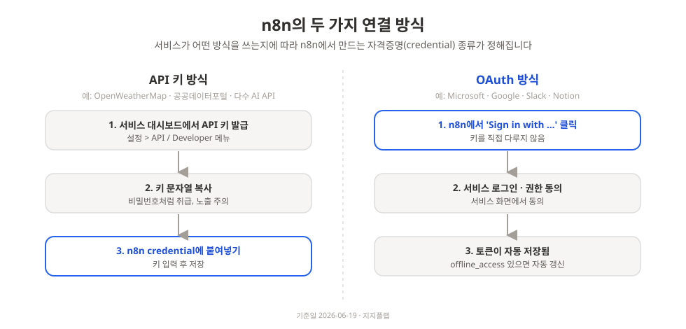

# credential과 API 키 기초

n8n으로 외부 서비스(Gmail, Slack, Notion, Microsoft 등)를 자동화하려면 "내가 그 서비스를 쓸 권한이 있다"는 것을 n8n에 알려줘야 합니다. 그 권한 정보를 n8n에서는 **credential(자격증명)** 이라고 부릅니다. 이 문서는 처음 쓰는 분을 위해 개념과 공통 절차를 정리합니다.

> **기준일: 2026-06-19**
> - n8n 공식: [Credentials 개요](https://docs.n8n.io/credentials/) · [credential 만들기](https://docs.n8n.io/credentials/add-edit-credentials/)

---

## 0. credential이 한마디로 무엇인가

n8n이 외부 서비스에 대신 로그인할 수 있도록 저장해두는 **열쇠 꾸러미**입니다. 한 번 만들어두면 여러 워크플로에서 그 열쇠를 골라 쓸 수 있습니다.

비유하면, 워크플로는 "할 일 지시서"이고 credential은 "그 일을 하기 위한 출입증"입니다. 지시서는 공유해도 출입증은 공유하지 않는 것이 안전합니다(§4).

---

## 1. 두 가지 연결 방식: API 키 vs OAuth

외부 서비스에 연결하는 방식은 크게 두 가지입니다. 어떤 방식을 쓸지는 서비스가 정해두며, n8n의 해당 노드가 요구하는 자격증명 종류를 따르면 됩니다.

| 구분 | API 키 방식 | OAuth 방식 |
|---|---|---|
| 모습 | 길고 무작위한 문자열 1개(또는 2개)를 받아 입력 | "○○로 로그인" 버튼을 눌러 동의 |
| 발급처 | 서비스의 개발자/설정 페이지에서 직접 발급 | 서비스 로그인 화면에서 동의하면 자동 발급 |
| 예 | OpenWeatherMap, 공공데이터포털, 많은 AI API | Google, Microsoft, Slack, Notion 등 |
| 장단점 | 입력은 간단하나 키 관리·노출에 주의 | 설정은 다소 복잡하나 키를 직접 다루지 않아 안전 |

> Microsoft(Outlook·Teams·OneDrive)와 Google은 대표적인 OAuth 방식입니다. Microsoft 연결은 [01 문서](01-microsoft-365-setup.md)에서 단계별로 다룹니다.

---

## 2. API 키는 어디서 받나

API 키 방식의 서비스는 보통 다음 흐름으로 키를 발급합니다. 서비스마다 메뉴 이름은 다르지만 원리는 같습니다.

1. 해당 서비스에 가입/로그인합니다.
2. 설정에서 **API**, **개발자(Developer)**, **API Keys** 같은 메뉴를 찾습니다.
3. **새 키 발급(Create/Generate API Key)** 을 누릅니다.
4. 생성된 키 문자열을 복사합니다. (일부 서비스는 이때만 보여주므로 바로 안전한 곳에 보관)
5. 사용량 한도·과금 정책을 확인합니다. (무료 한도, 호출 횟수 제한 등)

> 키는 비밀번호와 같습니다. 화면 공유·캡처·공개 저장소에 노출되지 않게 주의하세요.

---

## 3. n8n에서 credential 만드는 공통 절차

방식과 관계없이 n8n에서 credential을 만드는 흐름은 비슷합니다.

1. 왼쪽 메뉴 **Credentials > Create Credential**, 또는 노드 안의 credential 드롭다운에서 **Create New** 를 선택합니다.
2. 연결할 서비스의 자격증명 종류를 고릅니다. (노드 이름으로 검색하면 쉽습니다)
3. 방식에 따라 입력합니다.
   - **API 키 방식**: 발급받은 키(때로 추가 값)를 입력합니다.
   - **OAuth 방식**: **Sign in with ...** 버튼을 눌러 로그인·동의합니다.
4. 저장하고, 가능하면 연결 테스트로 정상 여부를 확인합니다.
5. 워크플로의 노드에서 방금 만든 credential을 선택해 사용합니다.

> 같은 credential을 여러 노드·여러 워크플로에서 재사용할 수 있습니다.

---

## 4. 보안: 꼭 지킬 것

| 원칙 | 이유 |
|---|---|
| 키를 코드·메시지·공개 저장소에 노출하지 않기 | 키 하나로 계정 권한이 통째로 넘어갈 수 있음 |
| 워크플로를 공유·내보내기 할 때 credential은 제외 | n8n은 export에 credential 비밀값을 포함하지 않음. 받는 사람이 본인 credential을 따로 연결 |
| 권한은 필요한 만큼만 | 과도한 권한은 사고 시 피해 범위를 키움 |
| 만료·갱신 관리 | OAuth 토큰, 클라이언트 비밀 등은 만료될 수 있음. 끊기면 다시 연결 |

> n8n은 credential의 비밀값을 암호화해 저장합니다. 그래도 키 자체의 노출 관리는 사용자 책임입니다.

---

## 5. 연결이 안 될 때 공통 점검

| 증상 | 점검 |
|---|---|
| "인증 실패/Unauthorized" | 키를 다시 복사해 공백 없이 입력했는지, 만료되지 않았는지 |
| OAuth 로그인 후 오류 | 리디렉트(콜백) 주소가 정확히 일치하는지 ([01 문서](01-microsoft-365-setup.md) 참고) |
| 처음엔 되다가 끊김 | 토큰·비밀 만료. 재발급 후 갱신 |
| 권한 부족 | 동작에 필요한 권한(스코프)이 빠짐. 서비스 쪽에서 권한 추가 |

---

## 6. 다음 단계

- 외부 노드를 추가하고 싶다면 → [02 커뮤니티 노드 설치하기](02-community-node-install.md)
- Microsoft 365 연결 → [01 Microsoft 365 연결하기](01-microsoft-365-setup.md)
