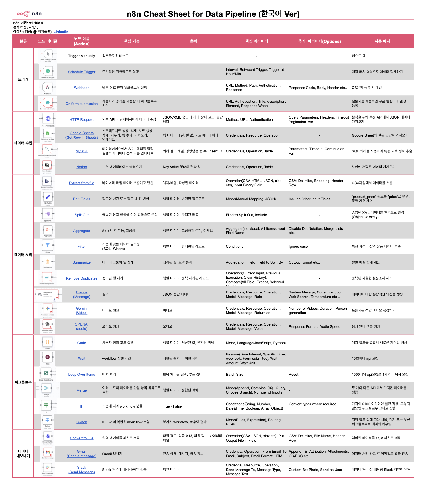

# n8n Playbook

한빛미디어 『n8n이 다해줌』 책 실습 자료와 실무 자동화 워크플로우를 함께 제공합니다.

#n8n #DataPipeline #Automation #NoCode #DataAnalysis

---

## 책 실습 가이드 — 『n8n이 다해줌』 (한빛미디어) / n8n-guidbook

- 저자: 이인영, 임정

| 장 / Ch. | 워크플로우 / Workflow | 주요 서비스 / Services | 링크 / Link |
|----|-----------|------------|------|
| 2장 | 구글 RSS 피드 뉴스 메일링 | Google News RSS, Gmail | [바로가기](./01-hanbit-n8n-guidebook/chap2/) |
| 3장 | OpenWeatherMap 날씨 알림 | OpenWeatherMap API, Discord | [바로가기](./01-hanbit-n8n-guidebook/chap3/) |
| 4장 | 장바구니 — 농산물 가격 AI Agent | KAMIS API, Google Gemini, Google Sheets | [바로가기](./01-hanbit-n8n-guidebook/chap4/) |
| 5장 | 회의록 STT | AssemblyAI, Google Gemini | [바로가기](./01-hanbit-n8n-guidebook/chap5/) |
| 6장 | OCR — 영수증 인식 자동화 | Upstage OCR, Google Gemini, Google Sheets | [바로가기](./01-hanbit-n8n-guidebook/chap6/) |
| 7장 | 주식 시세 — AI 투자 리포트 메일링 | 공공데이터포털 API, Google Gemini, Gmail | [바로가기](./01-hanbit-n8n-guidebook/chap7/) |

---

## 치트시트 / Cheatsheet

| 자료 / Resource | 설명 / Description | 링크 / Link |
|------|------|------|
| 데이터 파이프라인 치트시트 | 핵심 노드 한눈에 정리 (한/영 PDF, PNG) | [바로가기](./03-cheatsheet-for-datapipeline/) |

---

## 실무 유즈케이스 / UseCases

| # | 워크플로우 / Workflow | 주요 서비스 / Services | 링크 / Link |
|---|-----------|------------|------|
| 02 | 농수산물 시세 AI Agent | KAMIS API, Google Sheets | [바로가기](./02-usecases/02-workflow-farm-data/) |
| 03 | Slack 근태 관리 자동화 | Slack, Google Sheets | [바로가기](./02-usecases/03-workflow-attendance/) |
| 04 | 회의록 자동 요약 | 음성 인식, AI, Notion, Slack | [바로가기](./02-usecases/04-workflow-meeting-assistant/) |
| 05 | 이메일 자동 분류 및 일정 관리 | Gmail, Google Calendar, Google Sheets | [바로가기](./02-usecases/05-workflow-email-data/) |
| 06 | 예약 알림 시스템 | 웹앱, DB | [바로가기](./02-usecases/06-workflow-reservation-system-data/) |
| 07 | 서울 공공자전거 재고 관리 | 공공 API, KakaoTalk | [바로가기](./02-usecases/07-workflow-inventory-bicycle/) |
| 08 | 자동 가계부 | SMS, Google Sheets | [바로가기](./02-usecases/08-workflow-automatic-account-book/) |
| 09 | 지능형 파일 정리 | AI 분류, Google Drive, Google Sheets | [바로가기](./02-usecases/09-workflow-file-organizer/) |
| 10 | 주식 포트폴리오 리포트 | 주가 API, Gmail | [바로가기](./02-usecases/10-workflow-Stock-Portfolio-Report-data/) |
| 11 | OCR 문서 텍스트 추출 | Upstage OCR, Google Sheets | [바로가기](./02-usecases/11-workflow-OCR/) |
| 12 | 신규 직원 온보딩 자동화 | Gmail, Slack, DB | [바로가기](./02-usecases/12-workflow-onboarding-system/) |
| 13 | Google Sheets 버전 관리 및 복구 | Google Sheets, Slack | [바로가기](./02-usecases/13-workflow-google-sheet-manager/) |
| 14 | 날씨 기반 옷차림 추천 챗봇 | 날씨 API, AI Chat | [바로가기](./02-usecases/14-workflow-AI-Outfit-Concierge-Chatbot/) |

---

## 치트시트 프리뷰 / Cheatsheet Preview

---

## 기여자 / Contributors
> Organized by 임정(지지플랩)

- 임정 @ 지지플랩 · [LinkedIn](https://www.linkedin.com/in/jayjunglim/) · [블로그](https://snowgot.tistory.com)
- 윤소정 · [LinkedIn](https://www.linkedin.com/in/sjeong722/) · [블로그](https://jeong0722.tistory.com/)
- 이효원 · [LinkedIn](https://www.linkedin.com/in/hyowonlee1807/) · [블로그](https://dlgydnjs718.tistory.com/)
- 강동완 · [블로그](https://lovecat09.tistory.com/manage/posts/)
- 김차병 · [블로그](https://bitsoo97.tistory.com/)
- 이인영 · [LinkedIn](https://www.linkedin.com/in/2innnnn0)
- 이주영 · [LinkedIn](https://www.linkedin.com/in/jooyoung-yi-3181b4382/)
- 박수진 · [LinkedIn](https://www.linkedin.com/in/sujin-park-435842381/)
- 안규현 · [LinkedIn](https://www.linkedin.com/in/gyuhyun-ann-573b09165/)
